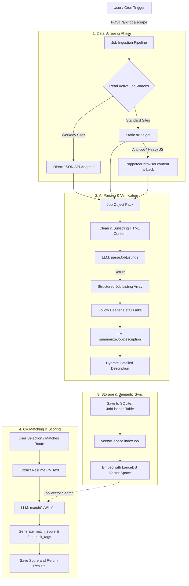

# FindMyJob - AI Powered Job Search & CV Manager

An automated web application designed to help you organize multiple variations of your CV and track individual application statuses, integrating background routines capable of matching relevant skill profiles against scraped search payloads flawlessly.

---

## 📂 Project Structure

Following strict deployment standards, the project is segregated into standalone backend and frontend frameworks:

```text
findmyjob/
├── .agents/            # Agent configuration files
├── backend/            # Express, Node.js + SQLite Service Layer
│   ├── app.js          # Express application setup
│   ├── index.js        # Application entry point
│   ├── config/         # Configuration files
│   ├── coverage/       # Test coverage reports
│   ├── data/           # SQLite database files
│   ├── db/             # SQLite Initializers
│   ├── middleware/     # Express middleware
│   ├── migrations/     # SQL Migration buckets (e.g., 001_initial.sql)
│   ├── routes/         # Express API routing nodes
│   │   ├── aiRoutes.js
│   │   ├── applicationRoutes.js
│   │   ├── cvRoutes.js
│   │   ├── jobRoutes.js
│   │   └── searchRoutes.js
│   ├── scripts/        # Utility scripts
│   │   ├── run_migrations.js
│   │   ├── seed_userroles.js
│   │   ├── seed_users.js
│   │   └── syncLanceDB.js
│   ├── services/       # Business logic layer (CV Parsing/Saving)
│   │   ├── aiService.js
│   │   ├── cvService.js
│   │   ├── scraperService.js
│   │   └── vectorService.js
│   ├── tests/          # TDD Jest test suite isolated streams
│   │   ├── health.test.js
│   │   ├── routes/     # Route tests
│   │   └── services/   # Service tests
│   ├── uploads/        # File upload storage
│   ├── utilities/      # Utility functions
│   └── utils/          # Additional utilities
├── frontend/           # Vite + React (TypeScript) Visuals
│   ├── coverage/       # Test coverage reports
│   ├── docs/           # Documentation
│   ├── public/         # Static assets
│   ├── src/
│   │   ├── assets/     # Image assets
│   │   ├── commoncomponents/ # UI Building blocks (TDD checked)
│   │   │   └── tests/   # Component tests
│   │   ├── components/ # Shared components
│   │   ├── hooks/      # React hooks
│   │   ├── layouts/    # Layout components
│   │   ├── pages/      # Views (Dashboard, Tracking table, CV manager)
│   │   │   ├── components/ # Page-specific components
│   │   │   │   ├── CustomDropdown.tsx
│   │   │   │   ├── JobCard.tsx
│   │   │   │   ├── Pagination.tsx
│   │   │   │   ├── SearchHeader.tsx
│   │   │   │   └── tests/   # Component tests
│   │   │   ├── tests/   # Page tests
│   │   │   ├── CVManager.tsx
│   │   │   ├── Dashboard.tsx
│   │   │   ├── JobSearch.tsx
│   │   │   ├── Settings.tsx
│   │   │   └── Tracker.tsx
│   │   └── utils/      # Utility functions
│   │   ├── App.tsx
│   │   ├── App.css
│   │   ├── index.css
│   │   ├── main.tsx
│   │   └── setupTests.ts
│   ├── __mocks__/      # Test mocks
│   ├── eslint.config.js
│   ├── jest.config.js
│   ├── postcss.config.js
│   ├── tailwind.config.js
│   ├── vite.config.ts
│   ├── tsconfig.json
│   ├── tsconfig.app.json
│   └── tsconfig.node.json
├── scrape_taleo.js     # Standalone scraper script
└── README.md
```

---

## 🛠️ Backend Setup & Usage

The backend initializes a local `SQLite` database located cleanly inside `backend/data/` creating automated schemas.

### 1. Install Dependencies
```bash
cd backend
npm install
```

### 2. Run Database Migrations (Automatic)
Your backend strictly uses Squashed migrators. Starting or testing the application runs `.sql` buffers inside `backend/migrations/` sequentially up to user indexing stubs natively without additional commands required.

### 3. Run Application
```bash
# Start server defaults bind to PORT 3000
npm run dev
```

### 4. Running TDD Tests
```bash
# Executes Jest streams isolated in memory buffers
npm test
```

---

## 🎨 Frontend Setup & Usage

The frontend uses `React` over `Vite` compiling highly formatted modular elements with rich visual dashboards designed correctly.

### 1. Install Dependencies
```bash
cd frontend
npm install
```

### 2. Start Dev Environment
```bash
npm run dev
```
From there, launch your browser into [`http://localhost:5173`](http://localhost:5173) to see live module nodes!

### 3. Running UI Unit Tests
```bash
npm test
```

### 4. Compiling Build Assets
```bash
npm run build
```

---

## 🔄 Data Ingestion & Processing Flow

The pipeline involves **Fetch Providers**, **AI-Assisted Structuring**, **Vector Storage Sync**, and **Reasoning Models Throttling**.



### 🛠️ Components Breakdown
* **Scraper (`jobRoutes.js`)**: Static (`axios`) or Dynamic (`Puppeteer`) fetch nodes.
* **AI Extract (`aiService.js`)**: Structuring raw text via context.
* **Vector Index (`vectors`)**: Instant sync with **LanceDB**.
* **Matcher**: Relevancy score generations flawlessly.

---

## 🏆 Current Key Systems Built
- ✅ **Secure CV Text Parsing streams** (Utilizing memory buffer disk storage pipes using `pdf-parse`)
- ✅ **Database schema tables** (Indexing Applications, Resumes cleanly mapped correctly)
- ✅ **Express Endpoint routers** mapped perfectly solving continuous file attachments accurately.
# findmyjob
