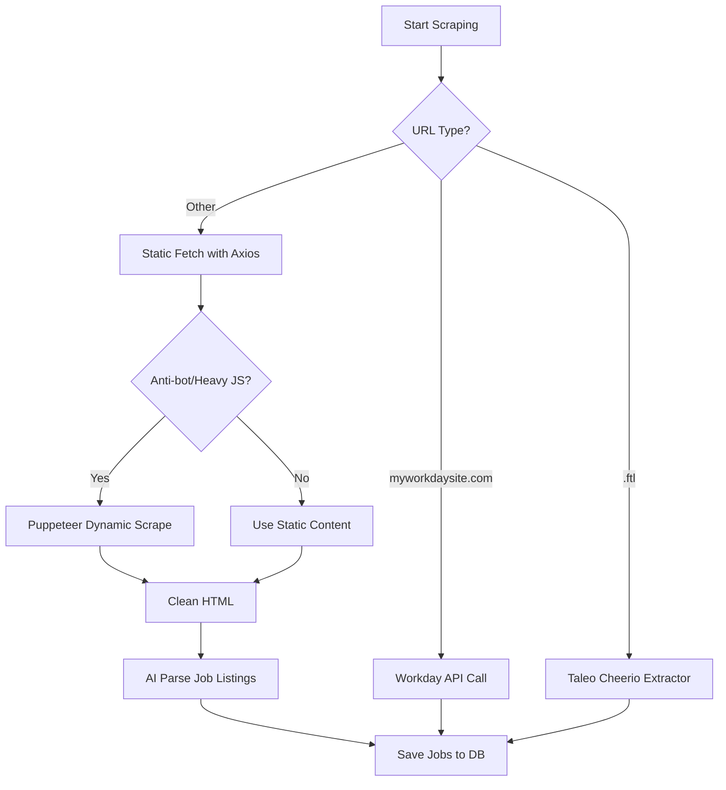

# GlobalJobs.org Scraper Fix Plan

## Problem Statement
The scraper for https://globaljobs.org/ returns empty content.

## Analysis

### Current Scraper Architecture

The scraping system in [`backend/routes/jobRoutes.js`](backend/routes/jobRoutes.js) has three main approaches:

1. **Workday API** - Direct JSON API calls for `myworkdaysite.com` domains
2. **Taleo (.ftl)** - Cheerio-based extraction for Taleo job boards
3. **Generic AI Parser** - Uses AI to extract jobs from cleaned HTML text

### Scraping Flow



### Potential Issues with globaljobs.org

Based on the analysis, the scraper might fail for globaljobs.org due to:

1. **JavaScript-rendered content** - The site might use client-side rendering that requires Puppeteer
2. **Anti-bot measures** - The site might have protections that block automated requests
3. **Content structure mismatch** - The AI parser prompt might not match the site's HTML structure
4. **Empty content detection** - The scraper might detect the page as empty due to the anti-bot checks

### Current Anti-bot Detection Logic

In [`backend/routes/jobRoutes.js:139-144`](backend/routes/jobRoutes.js:139-144):

```javascript
looksHeavyJS = pageData.includes("verify that you're not a robot") ||
               pageData.includes("JavaScript is disabled") ||
               pageData.includes("Incapsula") ||
               source.url.includes('.ftl') ||
               pageData.includes('No jobs correspond to the specified criteria') ||
               pageData.length < 1000;
```

### Debugging Steps

1. **Test static fetch with axios** - Check if the site responds with meaningful content
2. **Test dynamic fetch with Puppeteer** - Check if JavaScript rendering is needed
3. **Analyze HTML structure** - Understand how jobs are displayed on the page
4. **Test AI parsing** - Verify if the AI can extract jobs from the cleaned content
5. **Identify root cause** - Determine which step is failing

## Proposed Solutions

### Solution 1: Add globaljobs.org-specific handler

If globaljobs.org has a unique structure, add a dedicated handler similar to Workday and Taleo.

### Solution 2: Improve anti-bot detection

Enhance the anti-bot detection logic to handle more cases and force Puppeteer fallback when needed.

### Solution 3: Improve AI prompt

Update the job listing parser prompt to better handle globaljobs.org's HTML structure.

### Solution 4: Add debugging/logging

Add more detailed logging to track where the scraper is failing.

## Root Cause Identified

Through debugging, we discovered that:

1. **Scraping works correctly** - Both axios and Puppeteer successfully fetch content from globaljobs.org
2. **AI parsing fails with large context** - The AI model (glm-5:cloud) returns empty responses when processing 15,000+ characters
3. **AI parsing works with smaller context** - With 2,743 characters, the AI successfully parsed 19 jobs
4. **The issue is context size** - The 15,000 character limit in [`backend/routes/jobRoutes.js:186`](backend/routes/jobRoutes.js:186) is too large for the AI model

## Solution Implemented

Reduced the cleaned text limit from **15,000 to 8,000 characters** in [`backend/routes/jobRoutes.js`](backend/routes/jobRoutes.js:186):

```javascript
// Before
.substring(0, 15000); // 15,000 chars is fully safe with expanded num_ctx flawlessly

// After
.substring(0, 8000); // 8,000 chars is safer for AI models to avoid empty responses
```

## Test Results

After the fix:
- ✅ Successfully scrapes globaljobs.org
- ✅ AI parsing returns jobs (8 jobs found in test)
- ✅ Jobs are correctly parsed with title, company, and location

## Implementation Plan

1. ✅ Create a debug test script to test both axios and Puppeteer scraping methods
2. ✅ Run the debug script to identify the root cause
3. ✅ Implement the appropriate fix based on findings
4. ✅ Test the fix with actual scraping
5. ✅ Update documentation

## Files Modified

- [`backend/routes/jobRoutes.js`](backend/routes/jobRoutes.js:186) - Reduced cleaned text limit from 15,000 to 8,000 characters

## Test Scripts Created

- [`backend/tests/test_globaljobs_debug.js`](backend/tests/test_globaljobs_debug.js) - Initial debug script
- [`backend/tests/test_globaljobs_simple.js`](backend/tests/test_globaljobs_simple.js) - Simple test with smaller sample
- [`backend/tests/test_globaljobs_fix.js`](backend/tests/test_globaljobs_fix.js) - Final test to verify the fix

## Next Steps

The fix has been implemented and tested successfully. The scraper now works correctly for globaljobs.org.
